# NATS Playground

A collection of hands-on experiments with [nats.py](https://nats-io.github.io/nats.py/) to explore distributed messaging patterns, scalability, and asynchronous communication.

## Experiments

### 1. Hello World (The Basics)

A foundational script implementing the complete NATS connection workflow based on the official documentation.

- **Key Features:** Remote connection to the `demo.nats.io` server, subscription handling, and basic message publishing.
- **Concepts:** Connection lifecycle, subjects, and byte encoding.


- **Workflow:** The diagram above illustrates a simple loopback flow. The client connects to the server, subscribes to the `hello` subject, publishes a message to that same subject, and confirms that it receives its own message.

### 2. Native Load Balancer (Queue Groups)

An advanced demonstration of NATS's built-in horizontal scaling capabilities.

- **The Scenario:** Simulating a log processing system where multiple workers share the load to prevent duplicate processing.

- **Implementation:**
    - **Workers:** Three independent processes created using the `multiprocessing` library, all joined in a single Queue Group (`log_workers`).
    - **Publisher:** Dispatches 30 rapid-fire messages to the `logs.process` subject.

- **Key Insight:** Demonstrates how NATS automatically handles load distribution (balanced delivery) between active workers. If one worker fails, the others seamlessly take over the traffic.


- **Workflow:** The diagram depicts the distribution logic. The publisher sends multiple messages to the `logs.process` subject. The NATS server acts as a load balancer, routing each message to only one of the available workers in the `log_workers` queue group, ensuring the workload is shared and not duplicated.

### 3. Asynchronous RPC (Request-Reply Pattern)

A demonstration of NATS acting as a high-performance alternative to traditional HTTP for service-to-service communication.

- **The Scenario:** A "Math Microservice" that accepts data, performs a calculation, and returns the result to the requester.

- **Implementation:**
    - **Client:** Generates two random numbers, serializes them into a JSON payload, and uses the `request()` method (waiting for a reply).
    - **Server:** Subscribes to `math.sum`, deserializes the incoming JSON, performs the sum, and sends the result back using `msg.respond()`.

- **Key Insight:** Shows how NATS abstracts the complexity of correlating requests and responses. To the developer, it looks like a synchronous function call, but under the hood, it is fully asynchronous and decoupled.


- **Workflow:** The diagram shows the request lifecycle. First, the `Math Service` subscribes to the topic. When the client sends a request, NATS routes it to the service. The service computes the result and sends a reply, which NATS delivers back to the specific client's inbox.

### 4. JetStream & Durable Consumers (Persistence)

An exploration of NATS JetStream to achieve message persistence and guaranteed delivery, overcoming the "at-most-once" limitation of Core NATS.

- **The Scenario:** "Order Processing System" where data integrity is critical. Even if the processing service is offline when an order comes in, it must receive the historic data immediately upon recovery.

- **Implementation:**
    - **Publisher:** Initializes the JetStream context, creates a memory-based stream (`playgrnd_stream`), and publishes persistent messages.
    - **Consumer:** Establishes a Durable Subscription. It processes missed messages upon reconnection and explicitly acknowledges (`ack`) them to update the server's cursor.

- **Key Insight:** Demonstrates Temporal Decoupling. Unlike standard Pub/Sub, the publisher and consumer do not need to be online simultaneously. The Durable Consumer ensures "at-least-once" delivery by remembering exactly where it stopped reading in the stream.


- **Workflow:** The diagram highlights the temporal separation between systems. The Publisher stores messages in the Stream while the Consumer is offline. When the `Durable Consumer` eventually connects, it retrieves the stored history from the Stream and acknowledges processing.

### 5. Key-Value Store (Real-time State Management)

A practical implementation of NATS Key-Value (KV) store, utilizing JetStream to manage distributed application state without external databases like Redis.

- **The Scenario:** A live "Feature Flag" system where an administrator can toggle a "Maintenance Mode" setting.

- **Implementation:**
    - **Admin:** Connects to the JetStream context, creates a KV bucket (`configs_playgrnd`), and cyclically updates the `site_maintenance` key (true/false).
    - **App:** Instead of querying the database repeatedly (polling), it utilizes the `kv.watch()` method to detect changes.

- **Key Insight:** Demonstrates the concept of Reactive State. The application receives configuration updates immediately (push-based) rather than asking for them.


- **Workflow:** The diagram illustrates the reactive pattern. The Admin initializes the bucket and creates the key. The App (Watcher) registers interest in the key. When the Admin updates the value, NATS immediately "pushes" the new state to the App without the need for polling.

*Note on Experimental Status:* The Key-Value abstraction in `nats-py` is currently experimental. In this specific demonstration, the watcher captures the state change event but may close the connection immediately after the first update, rather than maintaining a persistent stream, reflecting the current stability of this feature in the Python client.

### 6. IoT Integration (MQTT Ingress)

A demonstration of NATS's polyglot capabilities, acting as a native MQTT broker to bridge edge devices with backend microservices.

- **The Scenario:** An IoT temperature sensor (simulated using `paho-mqtt`) sends data via the MQTT protocol, which is instantaneously received and processed by a backend service using the native NATS protocol.

- **Implementation:**
    - **Sensor (MQTT):** Connects to the NATS server on port `1883` (standard MQTT port) and publishes JSON data to the `device/temp` topic.
    - **Backend (NATS):** Connects using the standard NATS client and subscribes to `device.temp`.

- **Key Insight:** Highlights the seamless interoperability without external gateways. NATS automatically translates the protocols and maps the subjects (converting MQTT's `/` separator to NATS's `.`), allowing edge devices and cloud services to communicate natively.

```mermaid
sequenceDiagram
    participant Sensor as IoT Sensor (MQTT)
    participant MQTT as NATS MQTT Ingress
    participant NATS as NATS Core
    participant Backend as Backend Service (NATS)

    Backend->>NATS: subscribe("device.temp")
    Sensor->>MQTT: publish("device/temp", JSON)
    MQTT->>NATS: map topic → subject ("device.temp")
    NATS-->>Backend: deliver("device.temp", JSON)
```



- **Workflow:** The diagram illustrates the cross-protocol bridging. The Backend initiates a subscription to the native NATS subject `device.temp`. When the IoT Sensor publishes to the MQTT topic `device/temp`, the NATS server internally translates the topic separators (mapping `/` to `.`) and delivers the payload to the NATS subscriber, enabling transparent communication between the two protocols.

## Installation

To run the experiments, you will need the NATS client and the MQTT library (for the IoT demo).

```bash
pip install nats-py paho-mqtt
```

